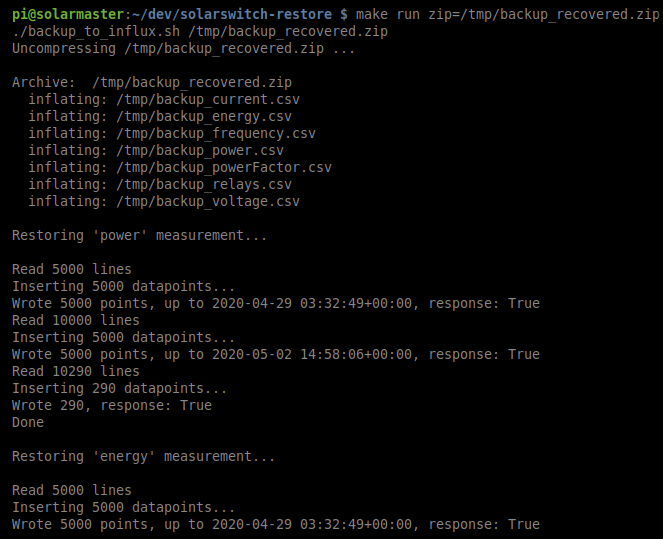

# solarswitch-restore
This repository is part of the [SolarSwitch prototype](https://twitter.com/bandaangosta/status/1179594894609981441) support package and contains utilities to:

  * Populate `solarswitch` database from any given database backup (full or partial) consisting of zipped InfluxDB-compatible CSV files.
  * Analyze system logs in search for sensor measurements for any given time range. This is particularly relevant for database failures that could have lead to data loss. Database reconstruction is then possible. Output of this tool are InfluxDB-compatible CSV files, ready for database restoring.

## Usage

### Database restore

This tool takes a zipped file containing CSV-formatted data files, as needed by InfluxDB `solarswitch` database, and restores data to such database. This also allows to keep copies of main database in sync for cloud visualization, for example.   
Only new data will be inserted. Existing datapoints will be unaffected. `solarswitch` database must already exist.

Steps:

 1. Clone repository to host machine where database will be restored.
 2. In repository directory, run `make venv` to setup needed libraries.
 3. To execute database restoring, run `make run zip=<path to zip file>`  
    Replace `<path to zip file>` with full path to zipped file containing CSV data files. For example:

        $ make run zip=/tmp/backup_recovered.zip 

### Log analysis and database reconstruction tool

This tool processes SolarSwitch prototype system logs to extract data measurements to InfluxDB-compatible CSV files.
You first need to setup your environment. If not done before, follow steps 1 and 2 from previous section.

Usage is as follows:

    $ logextractor.py --help
    Usage: logextractor.py [OPTIONS] PATH_TO_LOG

      Process SolarSwitch prototype system logs to extract data measurements to
      InfluxDB-compatible CSV files.

      Path to log file is required as argument. Typically, log file is named
      /data/logs/solarwitch.log or similar.'

    Options:
      -s, --timestamp_from TEXT  (optional) Limit log extraction to start from
                                 this UTC timestamp in format yyyy-mm-ddTHH:MM:SS

      -e, --timestamp_to TEXT    (optional) Limit log extraction to end up to this
                                 UTC timestamp in format yyyy-mm-ddTHH:MM:SS

      --help                     Show this message and exit.

Example:

    $ ./logextractor.py /data/logs/solarswitch.log

Limiting time range of logs analysis:

    $./logextractor.py --timestamp_from 2020-03-29T00:00:00 --timestamp_to 2020-05-02T23:59:59 /tmp/logs/full_logs.log

You may want to concatenate rotating logs for extended analysis first and provide such file to logextractor.py:

    $ cat solarswitch.log* > full_logs.log

## Credits

Credits for main csv-to-influxdb script go to [https://github.com/fabio-miranda/csv-to-influxdb](https://github.com/fabio-miranda/csv-to-influxdb)
